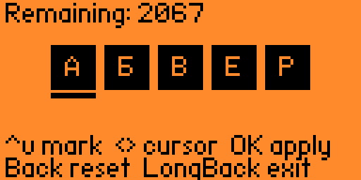

# Russian Wordle Solver For Flipper Zero

This is demo of videcoding using OpenCode and DeepSeek V4 Flash Free

## How to build

> rustup target add thumbv7em-none-eabihf

> cargo build --release

## How to install
Create dir on sdcard "apps/Wordle" and put here these files:
- `dict.bin` from project root
- `wordle-solver.fap` from `target\thumbv7em-none-eabihf\release`

## Controls
- `UP/DOWN` select letter status:
    - black background - correct letter
    - no background and thick border - letter is incorrect position
    - no background and thin border - no letter in word
- `OK` to confirm word status
- `BACK` press - restart
- Long `BACK` press - exit

## Screenshots

## Vibecoding
 You can look my session in `data/opencode_session.json`

## TODO
- fix all cyrillic letters bitmaps